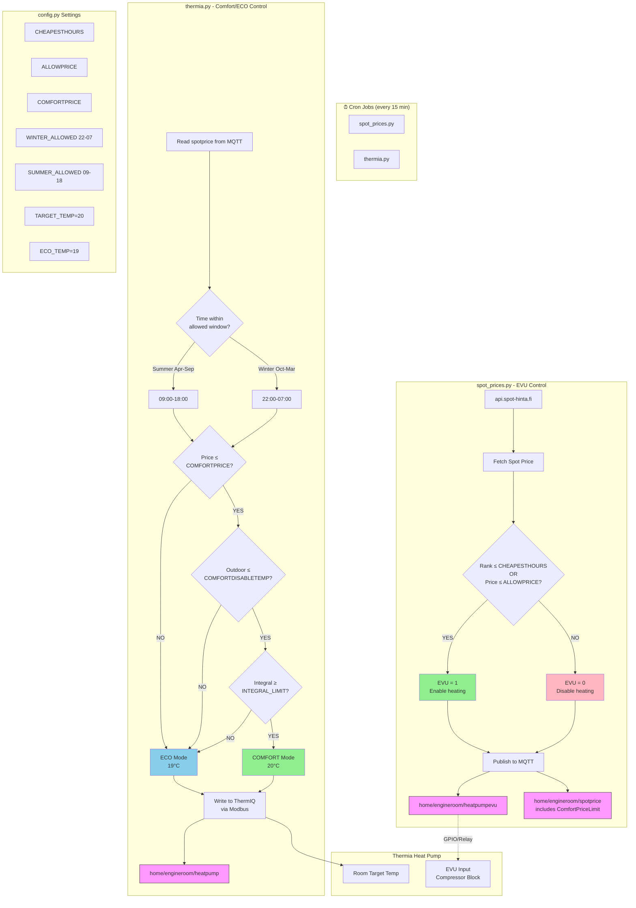

# Spot Price Heating Control Flow

## System Overview



## Script Responsibilities

| Script | Controls | Logic |
|--------|----------|-------|
| **spot_prices.py** | EVU (compressor block) | Rank ≤ CHEAPESTHOURS **OR** Price ≤ ALLOWPRICE |
| **thermia.py** | Target temperature | Time window **AND** Price ≤ COMFORTPRICE **AND** Outdoor temp **AND** Integral |

## Config Settings Quick Reference

### spot_prices.py settings
- `CHEAPESTHOURS` - Allow heating during X cheapest hours (1-24). Set 24 to always allow
- `ALLOWPRICE` - Always allow heating if spot price ≤ this (EUR/kWh)
- `COMFORTPRICE` - Published to MQTT for thermia.py to use

### thermia.py settings
- `SUMMER_ALLOWED_START/STOP` - Time window for summer comfort (Apr-Sep)
- `WINTER_ALLOWED_START/STOP` - Time window for winter comfort (Oct-Mar)
- `TARGET_TEMP` - Comfort mode target (°C)
- `ECO_TEMP` - ECO mode target (°C)
- `INTEGRAL_LIMIT` - Don't enable comfort if integral < this (prevents aux heater)
- `COMFORTDISABLETEMP` - Disable comfort if outdoor temp > this

## Fixed Electricity Contract Mode

When using a fixed price contract, manually set:
```python
CHEAPESTHOURS = 24      # EVU always enabled
COMFORTPRICE = 0.50     # Comfort always passes price check
```

Comfort heating will still only activate during the configured time windows (22:00-07:00 in winter).
